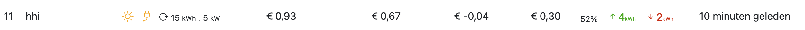
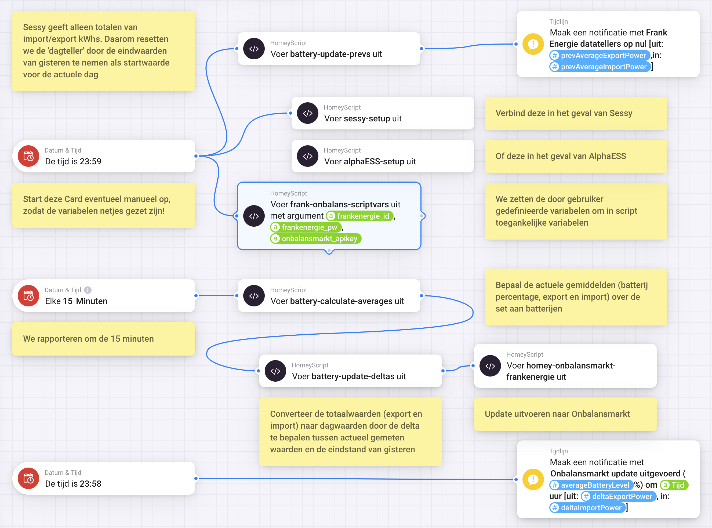
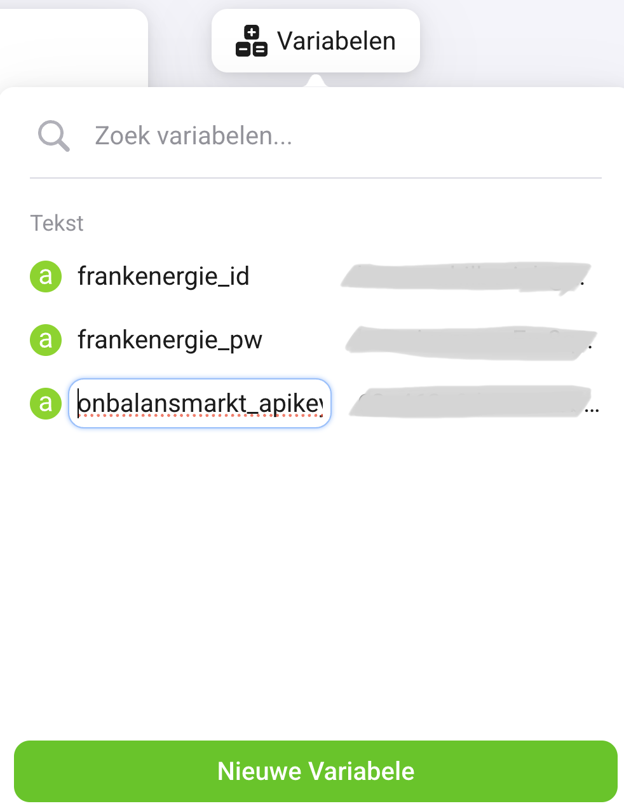

# onbalansmarkt-frankenergie-homey

Homey oplossing voor live-opbrengst rapportage op https://onbalansmarkt.com:
- Sessy thuisbatterijsysteem (1 tot n batterijen) 
-  of in experimentele fase, support voor AlphaESS thuisbatterijsysteem 
- Frank Energie slim handelen account

De scripting in deze repository is geschikt gemaakt voor rapportage over meerdere individuele (Sessy)batterijen wat oorspronkelijk ontbrak in het basisscript.  

Voorbeeld:

De repository bevat de benodigde Homeyscripts waarmee je een Advanced Flow kunt maken, zodat je onbalans resultaat periodiek (instelbaar) via de API kunt rapporteren naar de service.

Je hebt naast je account creditionals van je energiemaatschappij ook een API key nodig die je op kunt vragen na aanmelding bij Onbalansmarkt.

Enkele features waarmeer het basisscript is uitgebreid:
- rapportage over de gehele batterijcollectie aan aanwezige thuisbatterijen;
- rapportage van het actuele batterijpercentage gemiddelde;
- rapportage van de dan geldende Kwhs geladen en kWh ontladen waarden; 
- scripting is geanonimiseerd door login credentionals en de benodigde API-key extern aan het script aan te bieden;
- periode instelbaar van upload van de data naar onbalansmarkt.com;
- het is relatief eenvoudig een ander merk batterij zoals te bevragen, zie de **systeemk**-setup.js als voorbeeld, waarin de benodigde device capabilities per batterij staan waarover gerapporteerd. 

Onderstaand het screenshot hoe de gebruiker een Homey Advanced Flow kan maken. Helaas biedt Homey geen makkelijke manier aan om dit soort flows te exporteren cq importeren. Dit is handwerk en vergt kennis van hoe je een Advanced Flow kunt designen. 
- Sla de inhoud per .js bestand op als Homeyscript, met gelijksoortige naamgeving (naam zonder de extensie);
- Maak de globale variabelen aan (zie verderop);
- Maak de Advanced flow aan met daarbij de 'then' Homeyscipt - as script kaartjes, waarbij je per kaartje de naam van het overeenkomstige bestand kiest;
- Door met de muis op de '23:59 kaartje' te staan, is deze afzonderlijk te starten. Voer eventueel eenmalig uit als setup. De scripts zijn ook  uit te voeren in Homeyscript (< / >) mode zelf natuurlijk.

De Sessy API (als bijvoorbeeld) levert geen dagtotalen (alleen grand totals). Voor de rapportage per dag is opgelost met een delta gemiddelde te bepalen t.o.v. voorgaande dag.
Instelbaar welke periode (om de 15 minuten in dit voorbeeld) wordt de API van onbalansmarkt.com gevoed met nieuwe gegevens. 

Op de tijdlijn krijgt de Homey gebruiker een feed te zien van aangeleverde baterijpercentage en de(ont)laad kWhs. De scripting is relatief eenvoudig aan te passen voor andere batterijsystemen dan Sessy.

De login/password combinatie kan de gebruiker zelf opvoeren als Homey Flow variabele, zodat het script voortaan geen wijziging behoeft. Zie hiervoor onderstaand screenshot want de naamgeving en de manier van doorgeven moet overeenkomstig zijn. Het betreft hier een 'script met argument' kaartje met een komma tussen de variable namen: "frankenergie_id,frankenergie_pw,onbalansmarkt_apikey"

